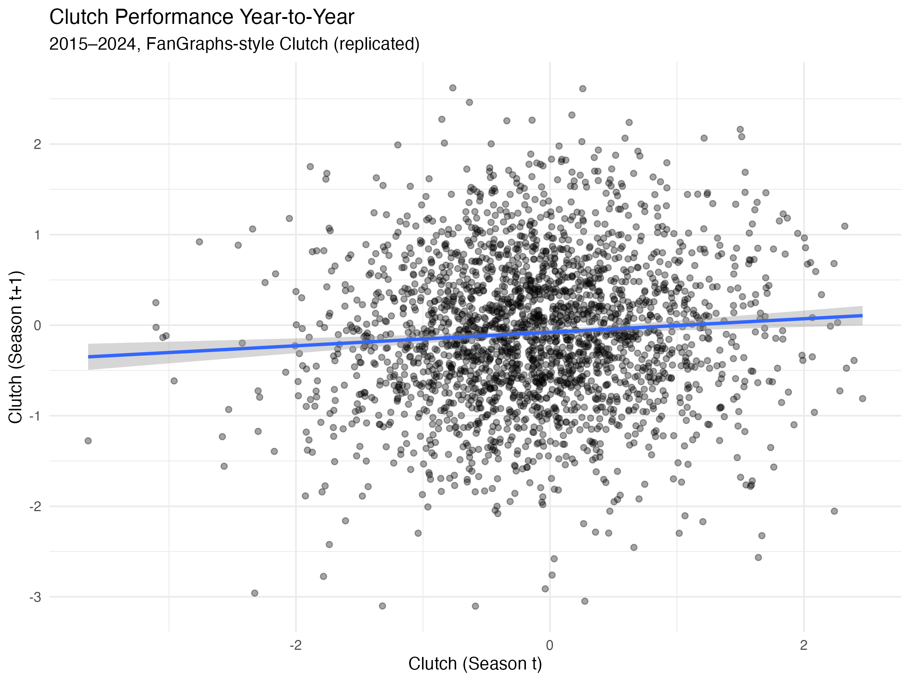

# Is Clutch Hitting a Repeatable Skill?

This project investigates whether MLB hitters exhibit persistent "clutch" performance
across seasons.

Using FanGraphs batting data from 2015–2024, I replicate the FanGraphs Clutch metric from
its underlying components (Win Probability Added and leverage context) and test whether
clutch performance in one season predicts performance in the next.

# Data
- Source: FanGraphs (via the `baseballr` R package)
- Population: Qualified MLB hitters (≥200 PA per season)
- Seasons: 2015–2024

# Methodology
Clutch is calculated as:

**Clutch = (WPA/pLI) − (WPA/LI)**

I then construct player-year pairs and compute the year-to-year correlation of clutch
values to assess stability.

# Results
- Year-to-year correlation of clutch: **r = 0.075**
- Less than 1% of future clutch performance is explained by past clutch results

# Conclusion
While individual seasons can show extreme clutch outcomes, clutch hitting does not persist
over time. The results suggest that observed clutch performance is largely driven by
variance rather than a repeatable player skill. Expect players who are very clutch or very unclutch to regress heavily to the mean next seaso

# Limitations & Future Work
- Alternative definitions of leverage (e.g., late & close situations)
- Bayesian shrinkage to account for sample size
- Comparison with Statcast-based metrics

# Reproducibility
All data is pulled programmatically using R.  
Run scripts in numerical order to reproduce the analysis.
